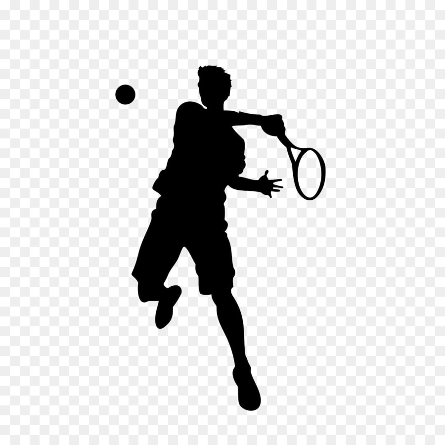

# Definición de la temática del  e-commerce.

>¿Qué tipo de e-commerce quiero hacer?

Voy a desarrollar un e-commerce deportivo más orientado para un público que juega el pádel, tenis.
En parte en mi provincia se está teniendo un fuerte crecimiento en estos dos deportes.
<br>

>¿Venta de ropa, insumos, electrodomésticos?

Mi e-commerce va a comercializar indumentaria, insumos para practicar ambos deportes.

<br>

>Es muy recomendado buscar inspiración en páginas que conozcamos, ya sea para sacar ideas, colores, tipografías, etc

Estas son las dos páginas donde voy a sacar información.

[Urbanpadel](https://urbanpadel.com.ar/)

[MasterTennis](https://www.mastertenis.com.ar/)

<br>

>Inventar una historia de la página (Una breve presentación con un listado de los productos que venderán en su página)

Esta e-commerce va a estar especializada en el campo deportivo, que va a ofrecer las mejores marcas importadas en Córdoba Capital, pone a su disposición una tienda deportiva virtual en donde se va a poder comprar de forma totalmente segura y transparente, lo que se va a comercializar es lo siguiente.


* Indumentaria deportiva (remera, zapatillas, short, medias, etc...)

* Insumos (tubo de pelotas, gorras, muñequeras, antibibradores, cubre grip, cuerdas para raqueta de tenis, etc..)

* Raquetas de tenis.
    * Las marcas que se van a comercializar: Wilson, Head, Babolat, yonex.

* Paletas de padel.
    * Las marcas que se van a comercializar: Royal, Head, Babolat, Ziux, Ur.ich, varlion, Zane, Bullpadel. 

<br>

>Público objetivo.

Mi público ronda entre los 6 años hasta los 80 años "Aprox.", es para ambos sexos. 

<br>

>Tipografía Principal

Las dos tipografía que voy a usar es:
* Helvetica.
* Gotham   

<br>

>Paleta de colores

```css
   *rosso corsa.
    background-color: #e20000;

   *negro intenso FOGRA 39.
    background-color: #09080C

   *Culto
    background-color: #FOEDDE;
    
   *Blanco
   background-color: #FFFFFF; 
```
<br>

>Creación de logo

Nombre del E-commerce: "Mega Sport".

imagen del Ecomerce: 


* La idea general es combinar la marca de la tienda y el logo para que quede algo similar a esta imagen.

